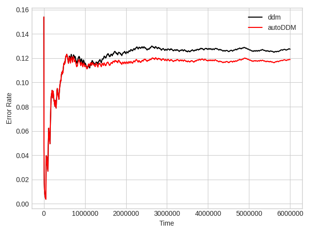

=================
Tutorials
=================

-----------------
Tutorial 1: Predicting Forest Cover Type using PEARL
-----------------

Data Set Information:

* Forest cover type is natural resource inventory information often economically or legally impossible to collect. Vital to any private, state, or federal land management agency.
* Collected from four wilderness areas located in the Roosevelt National Forest of northern Colorado.
* Contains variables such as wilderness areas and soil type.

Code ::

    %matplotlib notebook
    from matplotlib import pyplot as plt
    from matplotlib import animation
    from skika.ensemble import adaptive_random_forest, pearl

    class evaluate(object):
        def __init__(self, classifier):
            self.accuracy = 0
            self.num_instances = 0
            self.classifier = classifier

            self.classifier.init_data_source("data/covtype.arff");

        def __call__(self):

            correct = 0

            sample_freq = 1000

            for count in range(0, sample_freq):
                if not self.classifier.get_next_instance():
                    break

                # test
                prediction = self.classifier.predict()

                actual_label = self.classifier.get_cur_instance_label()
                if prediction == actual_label:
                    correct += 1

                # train
                self.classifier.train()

                self.classifier.delete_cur_instance()

            self.accuracy = correct / sample_freq
            self.num_instances += 1000

            return self.num_instances, self.accuracy

    num_trees = 60
    max_num_candidate_trees = 120
    repo_size = 9000
    edit_distance_threshold = 90
    kappa_window = 50
    lossy_window_size = 100000000
    reuse_window_size = 0
    max_features = -1
    bg_kappa_threshold = 0
    cd_kappa_threshold = 0.4
    reuse_rate_upper_bound = 0.18
    warning_delta = 0.0001
    drift_delta = 0.00001
    enable_state_adaption = True
    enable_state_graph = True

    arf_classifier = adaptive_random_forest(num_trees,
                                            max_features,
                                            warning_delta,
                                            drift_delta)
    arf = evaluate(arf_classifier)

    pearl_classifier = pearl(num_trees,
                             max_num_candidate_trees,
                             repo_size,
                             edit_distance_threshold,
                             kappa_window,
                             lossy_window_size,
                             reuse_window_size,
                             max_features,
                             bg_kappa_threshold,
                             cd_kappa_threshold,
                            reuse_rate_upper_bound,
                             warning_delta,
                             drift_delta,
                             enable_state_adaption,
                             enable_state_graph)
    pearl = evaluate(pearl_classifier)

    fig = plt.figure()

    x_arf = []
    y_arf = []
    x_pearl = []
    y_pearl = []

    max_samples = 580000

    def frames_arf():
        for i in range(max_samples):
            yield arf()

    def animate_arf(args):
        x_arf.append(args[0])
        y_arf.append(args[1])
        return plt.plot(x_arf, y_arf, color='C0', linestyle='-', label='ARF')

    def frames_pearl():
        for i in range(max_samples):
            yield pearl()

    def animate_pearl(args):
        x_pearl.append(args[0])
        y_pearl.append(args[1])
        return plt.plot(x_pearl, y_pearl, color='C1', linestyle='--', label='PEARL')

    anim_arf = animation.FuncAnimation(fig, animate_arf, frames=frames_arf, interval=1000)
    anim_pearl = animation.FuncAnimation(fig, animate_pearl, frames=frames_pearl, interval=1000)

    plt.xlabel('no. instances')
    plt.ylabel('accuracy')

    F = plt.gcf()
    Size = F.get_size_inches()
    F.set_size_inches(Size[0]*1.5, Size[1]*1, forward=True)
    plt.show()

Result:

.. image:: _static/covtype-results.svg

-----------------
Tutorial 2: Error rate comparison between AutoDDM and DDM on synthetic data stream
-----------------

Data Set Information:

* AGRAWAL data stream generator.

Code ::

    from skika.hyper_parameter_tuning.drift_detectors import AutoDDM
    from skmultiflow.drift_detection import DDM
    from skika.data.reccurring_concept_stream import RCStreamType, RecurringConceptStream, conceptOccurence
    import matplotlib.pyplot as plt
    import warnings
    import numpy as np
    import random
    import collections
    from skmultiflow.trees import HoeffdingTreeClassifier

    warnings.filterwarnings('ignore')
    plt.style.use("seaborn-whitegrid")

    # Global variable
    TRAINING_SIZE = 1
    STREAM_SIZE = 6000000
    grace = 1000
    tolerance = 500
    DRIFT_INTERVALS = [50000]
    concepts = [0, 1, 2]
    RANDOMNESS = 100

    seed = random.randint(0, 10000)
    keys = []
    actuals = [0]
    concept_chain = {0: 0}
    current_concept = 0
    for i in range(1, STREAM_SIZE + 1):
        for j in DRIFT_INTERVALS:
            if i % j == 0:
                if i not in keys:
                   keys.append(i)
                    randomness = random.randint(0, RANDOMNESS)
                    d = i + ((randomness * 1) if (random.randint(0, 1) > 0) else (randomness * -1))
                    concept_index = random.randint(0, len(concepts) - 1)
                    while concepts[concept_index] == current_concept:
                        concept_index = random.randint(0, len(concepts) - 1)
                    concept = concepts[concept_index]
                    concept_chain[d] = concept
                    actuals.append(d)
                    current_concept = concept

                    i2 = i + 17000
                    keys.append(i2)
                    randomness = random.randint(0, RANDOMNESS)
                    d = i2 + ((randomness * 1) if (random.randint(0, 1) > 0) else (randomness * -1))
                    concept_index = random.randint(0, len(concepts) - 1)
                    while concepts[concept_index] == current_concept:
                        concept_index = random.randint(0, len(concepts) - 1)
                    concept = concepts[concept_index]
                    concept_chain[d] = concept
                    actuals.append(d)
                    current_concept = concept

    x = collections.Counter(concept_chain.values())
    print(x)

    concept_0 = conceptOccurence(id=0, difficulty=6, noise=0,
                                 appearences=x[0], examples_per_appearence=max(DRIFT_INTERVALS))
    concept_1 = conceptOccurence(id=1, difficulty=6, noise=0,
                                 appearences=x[1], examples_per_appearence=max(DRIFT_INTERVALS))
    concept_2 = conceptOccurence(id=2, difficulty=6, noise=0,
                                 appearences=x[2], examples_per_appearence=max(DRIFT_INTERVALS))
    desc = {0: concept_0, 1: concept_1, 2: concept_2}

    datastream = RecurringConceptStream(
        rctype=RCStreamType.AGRAWAL,
        num_samples=STREAM_SIZE,
        noise=0,
        concept_chain=concept_chain,
        seed=seed,
        desc=desc,
        boost_first_occurance=False)

    X_train = []
    y_train = []
    for i in range(0, TRAINING_SIZE):
        X, y = datastream.next_sample()
        X_train.append(X[0])
        y_train.append(y[0])

    X_train = np.array(X_train)
    y_train = np.array(y_train)

    ht_auto = HoeffdingTreeClassifier()
    ht_auto.partial_fit(X_train, y_train)

    ht_ddm = HoeffdingTreeClassifier()
    ht_ddm.partial_fit(X_train, y_train)

    n_global = TRAINING_SIZE  # Cumulative Number of observations
    d_auto = 0
    d_ddm = 0
    TP_auto= []
    TP_ddm= []
    FP_auto = []
    FP_ddm = []
    Delay_auto = []
    Delay_ddm = []
    grace_end_auto = n_global
    grace_end_ddm = n_global
    accuracy_auto = 0
    accuracy_ddm = 0
    acc_x = []
    acc_y_auto = []
    acc_y_ddm = []

    ddm = DDM()
    autoDDM = AutoDDM(tolerance=tolerance)
    while datastream.has_more_samples():
        n_global += 1
        X_test, y_test = datastream.next_sample()

        if (n_global % 1000 == 0):
            acc_x.append(n_global)
            acc_y_auto.append(1 - (accuracy_auto / n_global))
            acc_y_ddm.append(1 - (accuracy_ddm / n_global))

        y_predict_ddm = ht_ddm.predict(X_test)
        ddm.add_element(y_test != y_predict_ddm)
        accuracy_ddm += 1 if y_test == y_predict_ddm else 0
        if (n_global > grace_end_ddm):
            if ddm.detected_change():
                d_ddm += 1
                drift_point_ddm = key = min(actuals, key=lambda x: abs(x - n_global))
                if (drift_point_ddm != 0 and drift_point_ddm not in TP_ddm and abs(drift_point_ddm - n_global) <= tolerance):
                    Delay_ddm.append(abs(n_global - drift_point_ddm))
                    TP_ddm.append(drift_point_ddm)
                    ht_ddm = HoeffdingTreeClassifier()
                    grace_end_ddm = n_global + grace
                else:
                    FP_ddm.append(drift_point_ddm)
        ht_ddm.partial_fit(X_test, y_test)

        y_predict_auto = ht_auto.predict(X_test)
        autoDDM.add_element(y_test != y_predict_auto, n_global)
        accuracy_auto += 1 if y_test == y_predict_auto else 0
        if (n_global > grace_end_auto):
            if autoDDM.detected_change():
                d_auto += 1
                drift_point_auto = key = min(actuals, key=lambda x: abs(x - n_global))
                if (drift_point_auto != 0 and drift_point_auto not in TP_auto and abs(drift_point_auto - n_global) <= tolerance):
                    Delay_auto.append(abs(n_global - drift_point_auto))
                    TP_auto.append(drift_point_auto)
                    ht_auto = HoeffdingTreeClassifier()
                    autoDDM.detect_TP(n_global)
                    grace_end_auto = n_global + grace
                else:
                    autoDDM.detect_FP(n_global)
                    FP_auto.append(drift_point_auto)
        ht_auto.partial_fit(X_test, y_test)

    print("Actual drifts:" + str(len(actuals)))

    print("Number of drifts detected by AutoDDM: " + str(d_auto))
    print("TP by AutoDDM:" + str(len(TP_auto)))
    print("FP by AutoDDM:" + str(len(FP_auto)))
    print("Mean Delay by AutoDDM:" + str(np.mean(Delay_auto)))
    print("Accuracy by AutoDDM:" + str(accuracy_auto / STREAM_SIZE))

    print("Number of drifts detected by DDM: " + str(d_ddm))
    print("TP by DDM:" + str(len(TP_ddm)))
    print("FP by DDM:" + str(len(FP_ddm)))
    print("Mean Delay by DDM:" + str(np.mean(Delay_ddm)))
    print("Accuracy by DDM:" + str(accuracy_ddm / STREAM_SIZE))

    plt.plot(acc_x, acc_y_ddm, color='black', label='ddm')
    plt.plot(acc_x, acc_y_auto, color='red', label='autoDDM')
    plt.xlabel("Time")
    plt.ylabel("Error Rate")
    plt.legend()
    plt.show()

Result:

